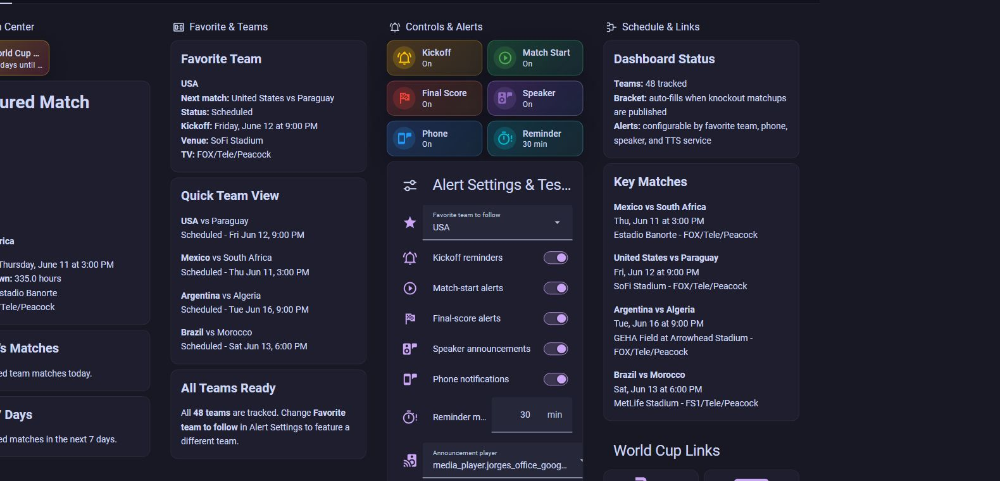
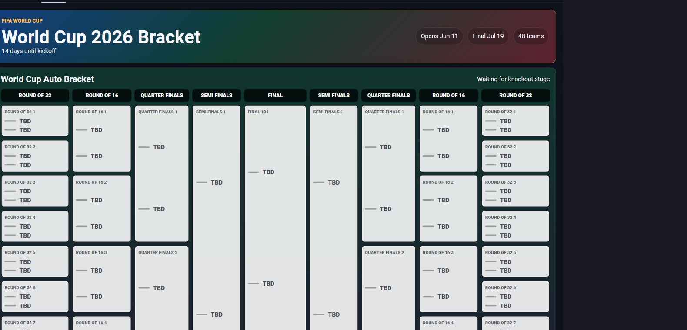

# World Cup Dashboard Card for Home Assistant

A HACS-installable Lovelace card for FIFA World Cup 2026 dashboards. It reads TeamTracker sensors and builds a clean match center with favorite-team focus, today's matches, upcoming matches, tracked teams, alert settings, quick test buttons, and an auto-updating knockout section.





## What It Does

- Uses your existing TeamTracker sensors.
- Works with a few teams or all 48 confirmed World Cup 2026 teams.
- Keeps user-specific devices configurable through helpers.
- Shows scores only when TeamTracker has real match data.
- Leaves knockout slots blank until TeamTracker/ESPN publishes real knockout matchups.
- Provides optional test buttons for selected speaker/TTS and phone notification helpers.
- Includes an overview mode and a bracket-only mode.

## Screenshot Setup

The screenshots above use:

- Theme: Catppuccin
- Home Assistant dashboard mode: panel cards for the card views
- Card config: `examples/full-dashboard.yaml`
- Team data: TeamTracker with all 48 World Cup 2026 teams
- Optional helpers: `examples/helpers-package.yaml`

The card has its own World Cup colors, so it works with other themes too. Catppuccin gives the surrounding Home Assistant shell the same dark purple look shown in the screenshots.

## What HACS Can And Cannot Do

HACS installs the dashboard card resource automatically. Home Assistant does not allow a HACS frontend card to automatically create dashboards, tabs, helpers, TeamTracker entries, phones, speakers, or automations.

To match the screenshots:

1. Install this card from HACS.
2. Install TeamTracker and add the teams to follow.
3. Add the optional helpers from `examples/helpers-package.yaml`.
4. Install and apply the Catppuccin theme for the same surrounding Home Assistant style.
5. Copy `examples/full-dashboard.yaml` into a dashboard raw editor.
6. Choose a favorite team, phone notification service, speaker, and TTS service from the dashboard controls.

## Requirements

- Home Assistant
- HACS
- TeamTracker installed through HACS
- One TeamTracker entry per team you want to follow

TeamTracker setup:

- Sport: `Soccer (International)`
- League: `WC`
- Team IDs: use abbreviations such as `USA`, `MEX`, `ARG`, `BRA`, `CAN`, `KOR`, `CZE`, `BIH`, `RSA`.

The full 48-team ID list is in `TEAMS.md`.

## Install With HACS

Until this is accepted as a default HACS repository, install it as a custom repository:

1. Upload this folder to a GitHub repository.
2. In Home Assistant, open HACS.
3. Open the three-dot menu, then choose Custom repositories.
4. Paste your GitHub repository URL.
5. Category: Dashboard.
6. Install `World Cup Dashboard Card`.
7. Clear browser cache or reload Home Assistant.

HACS will serve the card as:

```text
/hacsfiles/world-cup-dashboard-card/world-cup-dashboard-card.js
```

If Home Assistant does not add the dashboard resource automatically, add it manually:

```yaml
url: /hacsfiles/world-cup-dashboard-card/world-cup-dashboard-card.js
type: module
```

## Basic Card

```yaml
type: custom:world-cup-dashboard-card
title: World Cup 2026
team_sensors:
  - sensor.usa
  - sensor.mex
  - sensor.arg
favorite_team_helper: input_select.world_cup_favorite_team
announcement_player_helper: input_select.world_cup_announcement_player
tts_entity_helper: input_select.world_cup_tts_entity
notification_service_helper: input_select.world_cup_notification_service
show_controls: true
```

More examples are in `examples/`.

## Full Dashboard With Bracket Tab

For the closest out-of-the-box dashboard experience, use:

```text
examples/full-dashboard.yaml
```

It creates two views when pasted into a dashboard raw editor:

- `World Cup`
- `Bracket`

The first view uses:

```yaml
view_mode: overview
```

The bracket tab uses:

```yaml
view_mode: bracket
```

## Make It Look Like The Screenshots

1. Install the Catppuccin theme in Home Assistant.
2. Apply the theme from your Home Assistant profile.
3. Install TeamTracker from HACS.
4. Add TeamTracker entries for the teams you want. Use all 48 teams for the full screenshot layout.
5. Install this card from HACS.
6. Add helpers from `examples/helpers-package.yaml`, or create matching helpers manually.
7. Paste `examples/full-dashboard.yaml` into a dashboard raw configuration editor.
8. Change the `team_sensors` list if your TeamTracker entity IDs are different.
9. Select your own favorite team, phone notification service, announcement speaker, and TTS service in the Alert Settings card.

The bracket tab auto-fills only when TeamTracker/ESPN publishes real knockout matchups. Until then, the bracket intentionally shows clean `TBD` slots instead of fake predictions.

## Optional Helpers

Copy `examples/helpers-package.yaml` into a Home Assistant package, or create the helpers manually.

The card can use these helpers:

- `input_select.world_cup_favorite_team`
- `input_select.world_cup_announcement_player`
- `input_select.world_cup_tts_entity`
- `input_select.world_cup_notification_service`
- `input_boolean.world_cup_kickoff_alerts_enabled`
- `input_boolean.world_cup_match_start_alerts_enabled`
- `input_boolean.world_cup_final_score_alerts_enabled`
- `input_boolean.world_cup_speaker_announcements_enabled`
- `input_boolean.world_cup_phone_notifications_enabled`
- `input_number.world_cup_reminder_minutes`

## Blueprints

The `blueprints/` folder includes optional automation blueprints:

- Kickoff reminder
- Match started
- Final score

Create automations from the blueprints and select the TeamTracker sensor, media player, TTS service, and notification service for the Home Assistant instance.

## Public Sharing Notes

Do not hardcode personal entities in shared YAML. Use helpers for phones, speakers, TTS entities, notification services, and favorite teams. This card follows that pattern so it can be shared safely.
